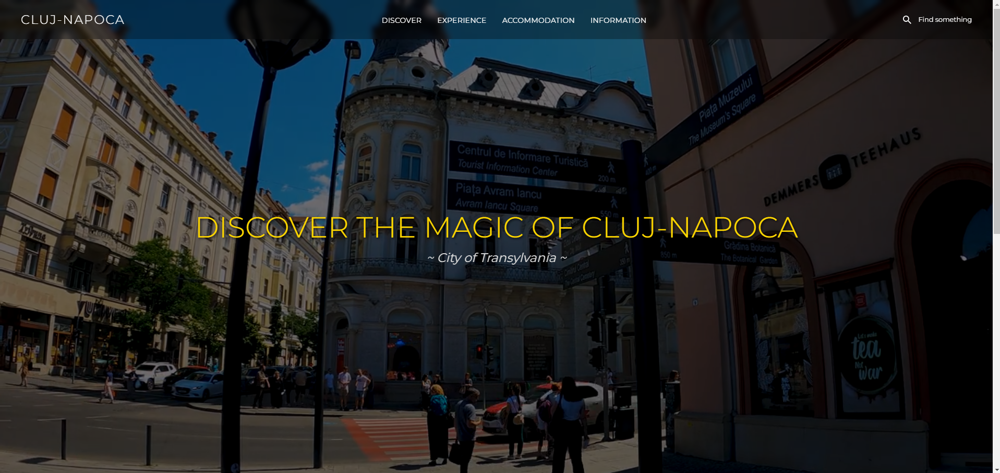
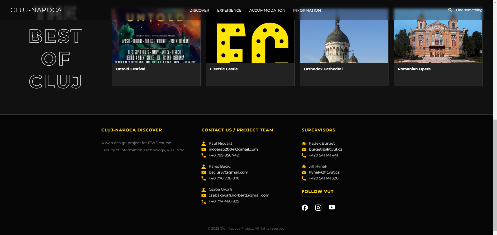

# ITWE (Web Design) Course Project - Brno University of Technology (VUT)


##  Cluj-Napoca Discover

A modern, responsive web presentation designed to showcase the tourism potential, history, and vibrant life of **Cluj-Napoca**, the heart of Transylvania.

This project was developed as a team assignment for the **ITWE** course, demonstrating proficiency in core web technologies **without the use of external CSS frameworks** (like Bootstrap or Tailwind).
[Click here to view site](https://paulnicoara252.github.io/ITWe_Cluj-Napoca_City_Presentation/)
<br>



##  Features

* **Multi-Page Architecture:** A comprehensive site structure with over 20 linked HTML documents.
* **Custom Mega Menu:** A complex, pure CSS dropdown navigation system organizing content into logical columns.
* **Dynamic Functionality (Vanilla JS):**
    * **Smart Search:** An overlay search engine with keyword mapping (redirects users based on input like "hotel", "food", "bus").
    * **Lightbox Gallery:** Custom JavaScript image viewer for the "Experience" and "Accommodation" pages.
* **Responsive Layouts:**
    * **CSS Grid & Flexbox:** Used for event calendars, photo galleries, and information cards.
    * **Horizontal Scroll:** Netflix-style scrolling for accommodation and sightseeing categories.
* **Modern Aesthetics:** Dark-themed design ("Dark Mode"), video backgrounds, and clean typography using Google Fonts (Montserrat).

##  Technologies Used

* **HTML5** - Semantic structure (header, nav, main, article, footer).
* **CSS3** - 100% Custom styling. No frameworks used.
    * Flexbox & Grid Layouts.
    * CSS Transitions & Animations.
    * Media Queries for responsiveness.
* **JavaScript (Vanilla)** - DOM manipulation for search, modal galleries, and navigation logic.
* **Google Maps Embeds** - Integration for location services.

##  Project Structure

```bash
/Cluj-Napoca-Discover
│
├── css/
│   ├── style.css       # Global styles (Header, Footer, Reset, Typography)
│   └── detail.css      # Specific styles for inner pages (Cards, Galleries, Grids)
│
├── js/
│   └── main.js         # JavaScript logic (Search Engine & Lightbox)
│
├── img/                # Organized assets folder
│   ├── history/        # Images for historical sites
│   ├── sites/          # Images for parks and landmarks
│   ├── culture/        # Images for museums and theaters
│   ├── food/           # Images for restaurants
│   ├── experience/     # Images for festivals and nightlife
│   └── accommodation/  # Images for hotels and hostels
│
├── index.html          # Landing Page
├── discover.html       # Main category page
├── experience.html     # Events & Nightlife hub
├── accommodation.html  # Hotels & Hostels listing
├── info.html           # General Information hub
└── [detail_pages].html # Individual pages (e.g., untold.html, samsara.html, etc.)
```

<details>
<summary><h3> Sitemap </h3></summary>
<br>



</details>

##  Technical Highlights

This project adheres to strict **Vanilla Web Development** principles:

* **Zero Frameworks:** No Bootstrap, Tailwind, or jQuery. Every pixel is styled with custom CSS.
* **Custom Search Engine:** Built a JavaScript-based keyword mapping system that redirects users to specific sections (e.g., typing *"bus"* redirects to `info.html`, typing *"untold"* redirects to `untold.html`).
* **CSS-Only Mega Menu:** Complex dropdown navigation built entirely with CSS `:hover` states and positioning, ensuring accessibility without heavy scripts.
* **Dynamic Lightbox:** A custom JavaScript modal system that scans the DOM for images and creates an immersive gallery experience automatically.
* **Responsive Design:** Fully fluid layouts using CSS Grid and Flexbox that adapt from Desktop to Mobile.

---
<div align="center">
   <h3> Authors (Team):</h3>
   <br>
   Paul Nicoară - Project Coordination & Development
   <br>
   Rareș Baciu - UI/UX Design & Implementation
   <br>
   Csaba Gyorfi - Content Strategy & Research
   <br>
   <h3>Supervisors:</h3>
   <br>
   Ing. Radek Burget, Ph.D.
   <br>
   doc. Ing. Jiří Hynek, Ph.D.
</div>
